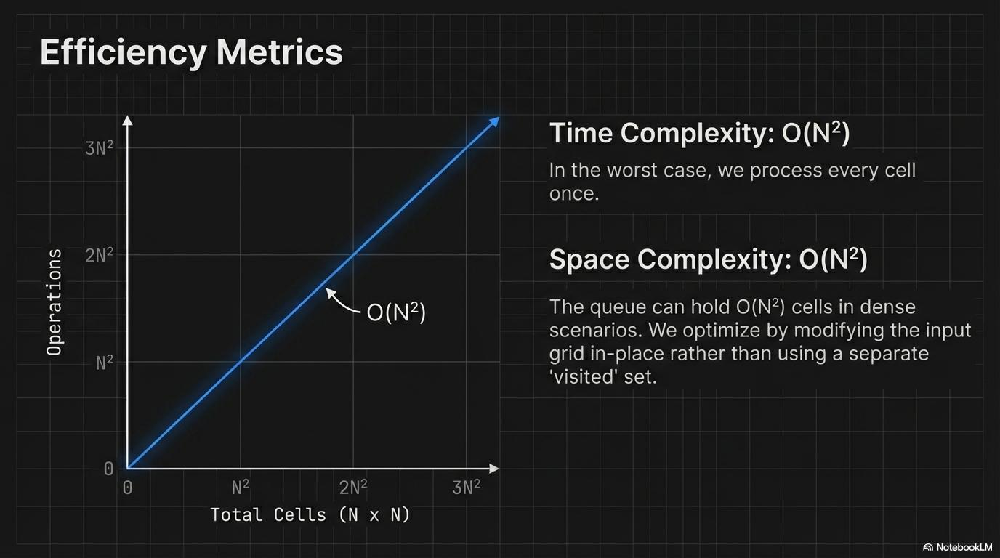
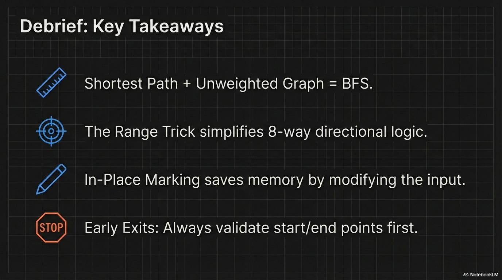
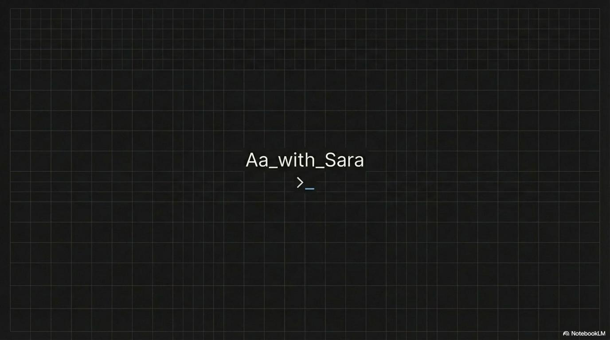
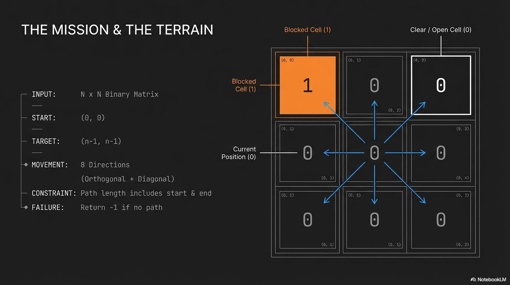
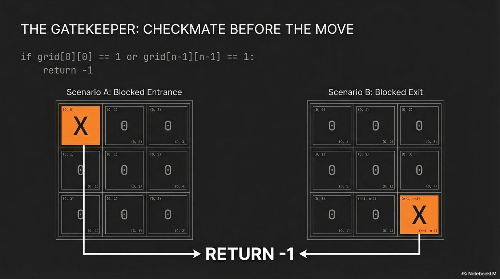
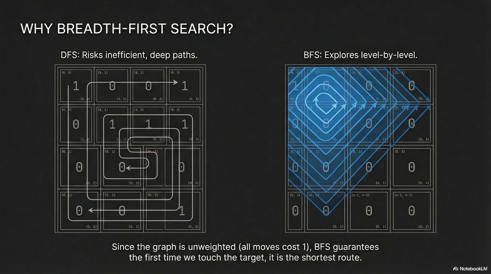
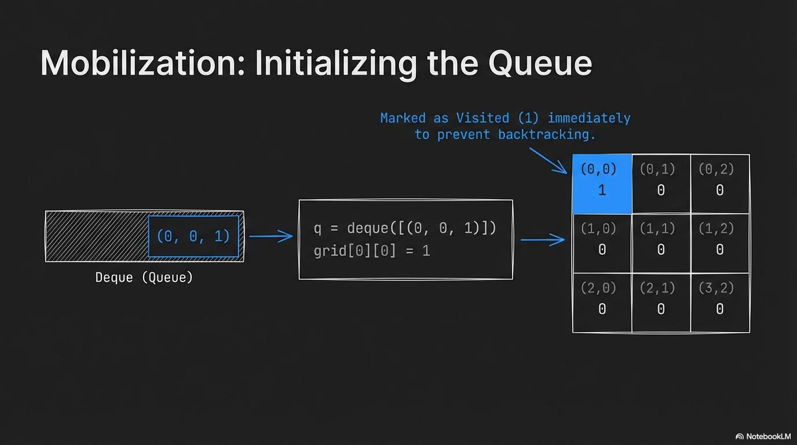
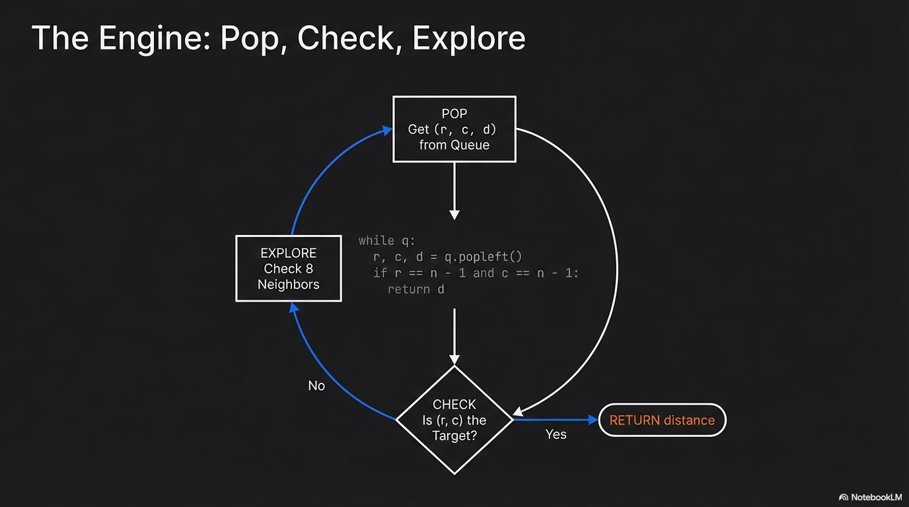
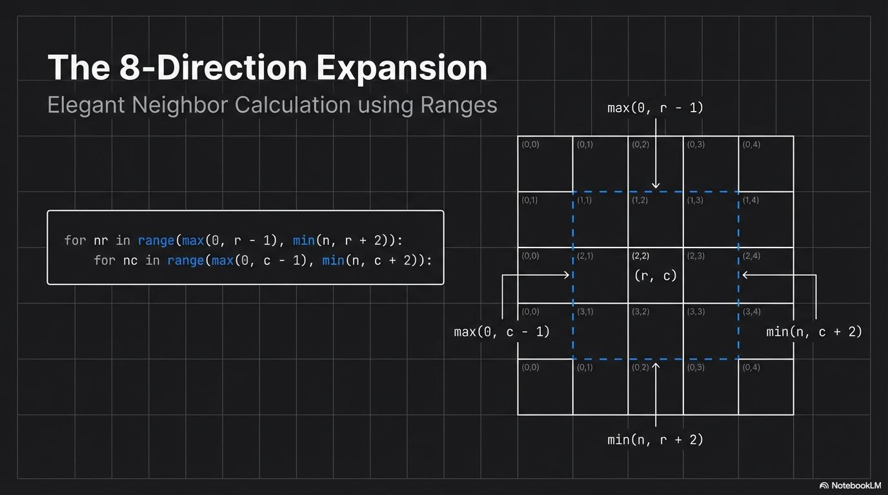
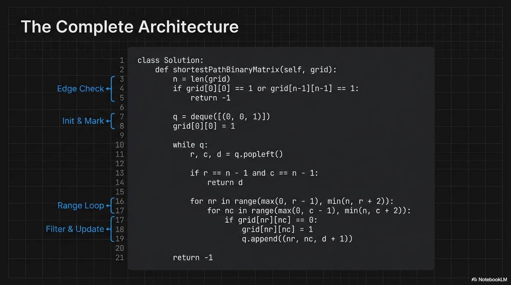

# Binary Matrix – Explanation Slides 📊

This section contains step-by-step visual explanations for the **Binary Matrix problem**.

All images are stored inside the `Explanation/` folder.

---

## 📌 Slides Overview

### 1. Problem Statement

### 2. Example Input & Output

### 3. Observations

### 4. Constraints Analysis

### 5. Brute Force Approach

### 6. Optimized Strategy

### 7. BFS / Traversal Logic

### 8. Direction Handling

### 9. Edge Cases

### 10. Implementation Flow

### 11. Time & Space Complexity

### 12. Final Summary

