# 😕 Count Unhappy Friends – Visual Explanation 📊

This repository provides a **step-by-step visual explanation** of the **Count Unhappy Friends** problem, designed to help understand the logic clearly before diving into the code.

All concepts are explained using **slides embedded directly in this README**.

---

## 🧠 What You Will Learn

- How the problem is structured  
- What makes a friend “unhappy”  
- Key observations and constraints  
- Why brute force is inefficient  
- Optimized strategy using preprocessing  
- Partner mapping and rank matrix  
- Mutual preference checking  
- Final algorithm flow  
- Time and space complexity  

---

## 📌 Explanation Slides

### 1. Problem Statement
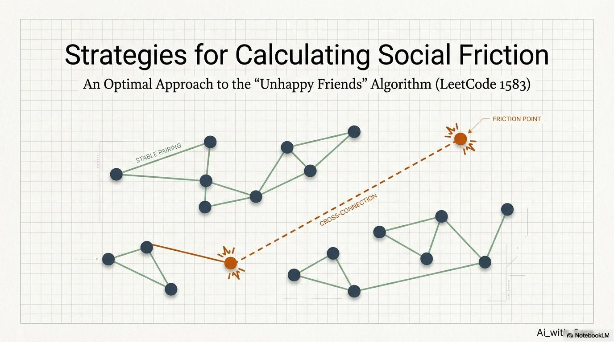

### 2. Rules & Initial Setup
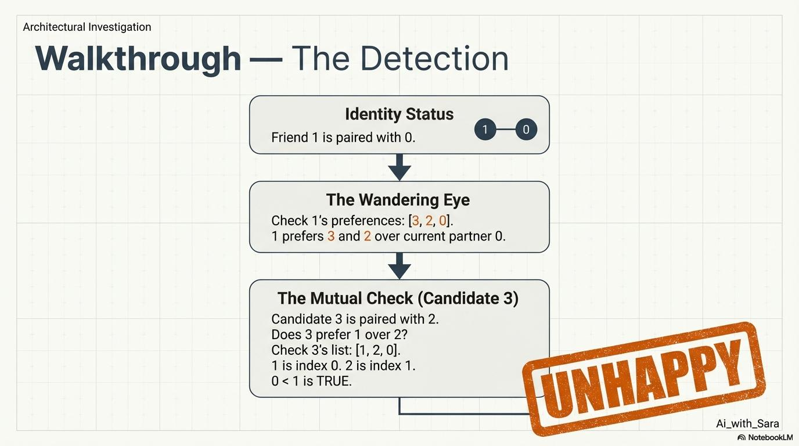

### 3. Defining an Unhappy Friend
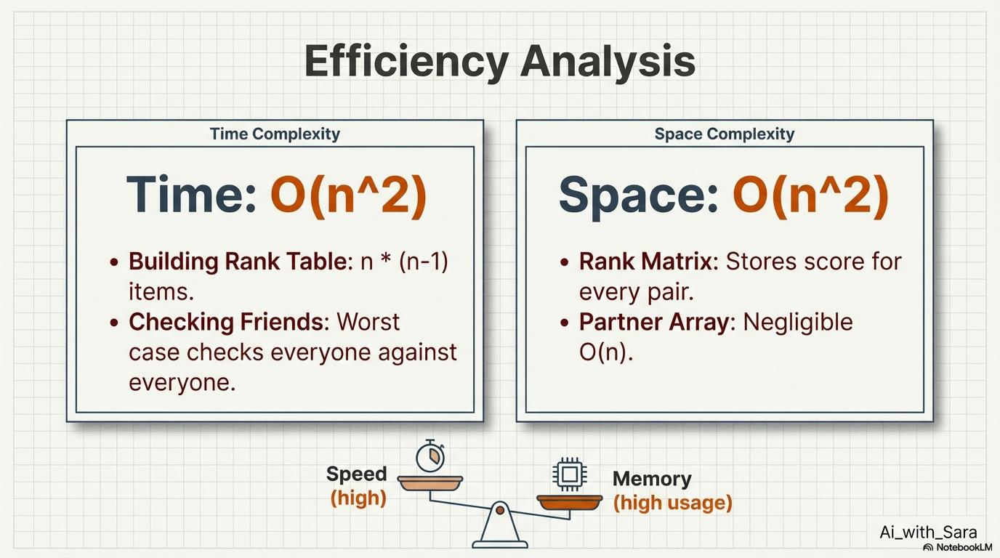

### 4. Key Observations
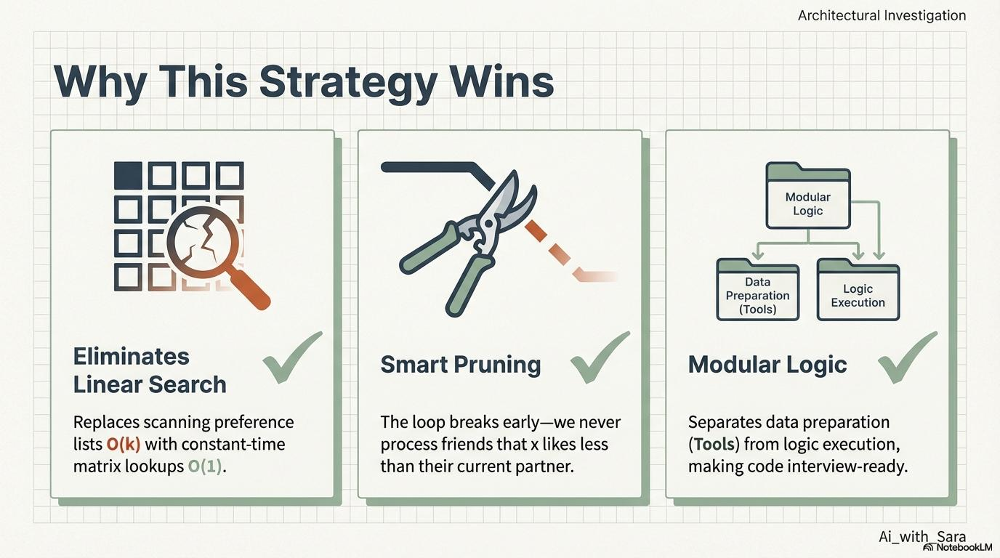

### 5. Brute Force Approach
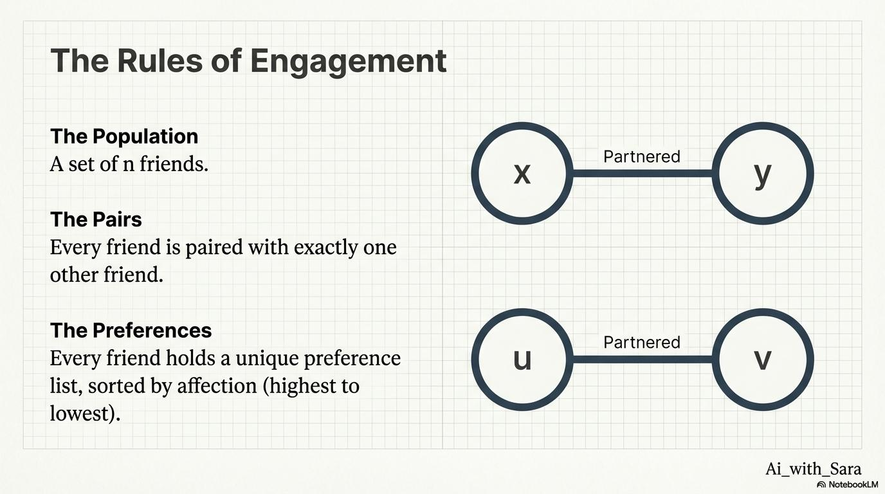

### 6. Partner Mapping (Preprocessing)
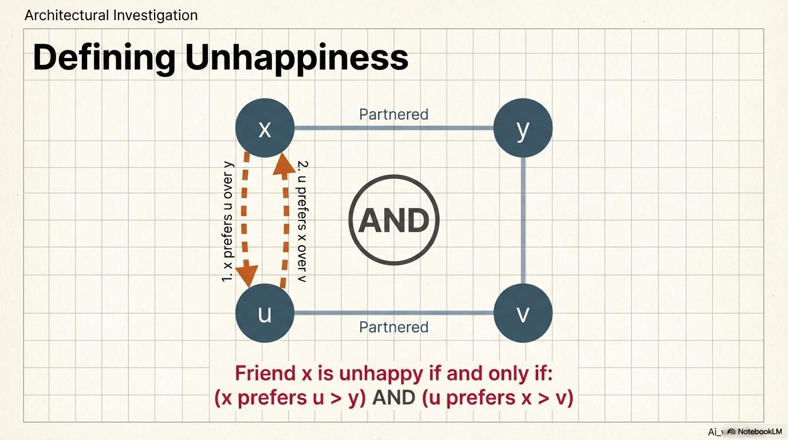

### 7. Rank Matrix Construction
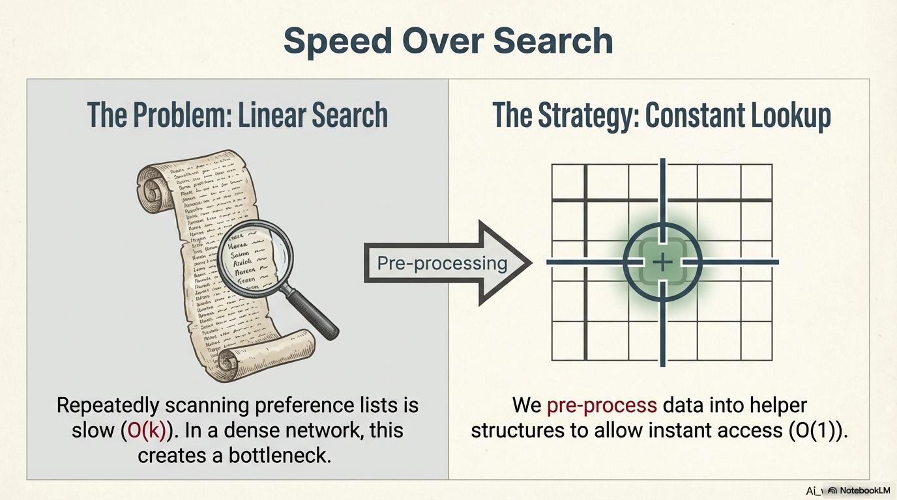

### 8. Mutual Preference Check
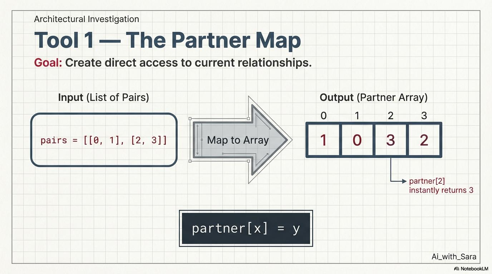

### 9. Step-by-Step Walkthrough
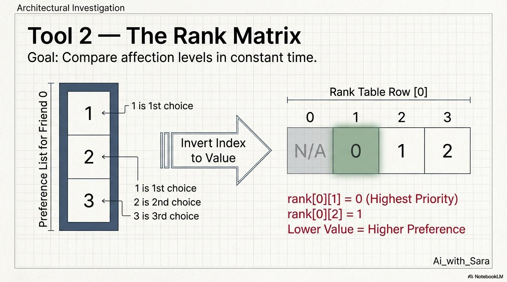

### 10. Optimized Algorithm Flow
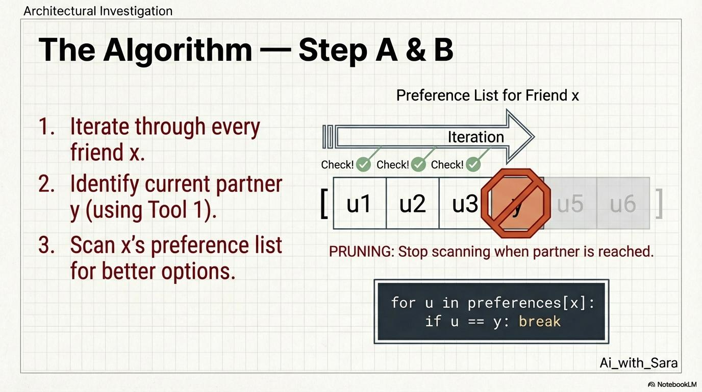

### 11. Time & Space Complexity
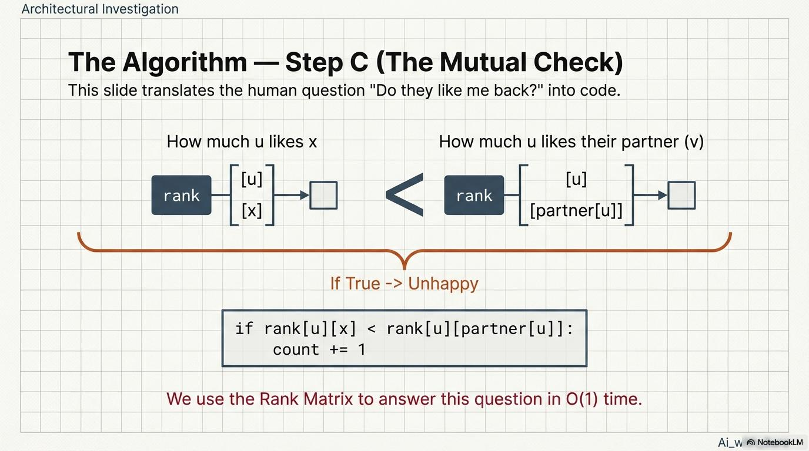

### 12. Final Summary
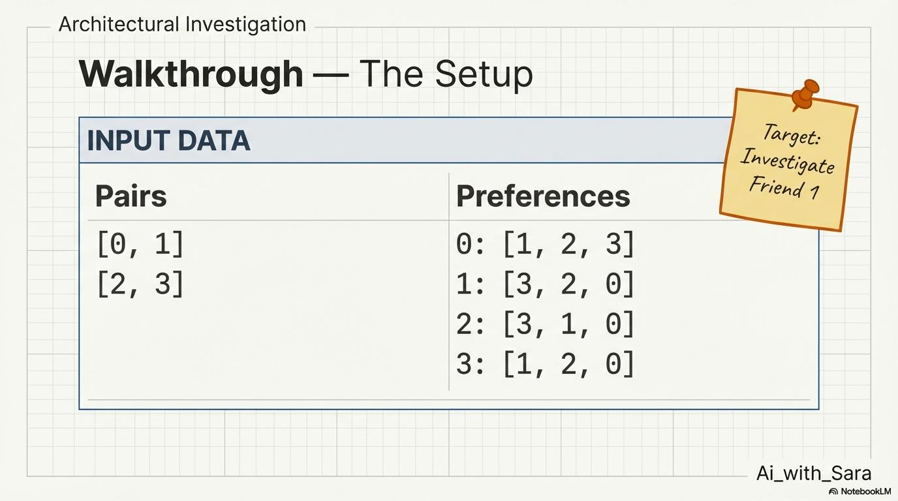

---

## 🎯 Key Takeaway

By **preprocessing partner relationships and preference rankings**, we avoid repeated scans and achieve an **efficient, interview-ready solution**.

Visual explanations make complex logic easier to understand and remember.

